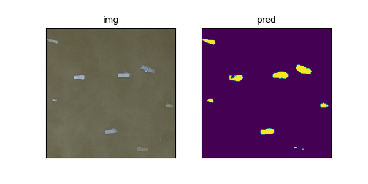

# Airbus Ship Detection

## Description

Train and run inference for ship segmentation task.



## Setup

Setup and activate conda environment:
```
$ conda create --name v_ship_segmentation --file requirements.txt
$ conda activate v_ship_segmentation
```

## Training

Run next command.

```
$ python ship_segmentation/scripts/train.py \
        --batch_size 8 \
        --learning_rate 1e-3 \
        --epochs 20 \
        --output_path "output"
```

Other options can be obtained with:

```
$ python ship_segmentation/scripts/train.py --help
```

## Inference

If you want to try my trained baseline, download it from google (val_dice=0.55.ckpt): [Link](https://drive.google.com/drive/folders/1CcM5umt79DzRcDOe7YY5pR_N31gcHhCU?usp=drive_link).

Run next command.

```
$ python ship_segmentation/scripts/predict.py \
        --image_path "samples/images/4de149bd9.jpg" \
        --ckpt_path "samples/baseline/ckpts/val_dice=0.55.ckpt"
```

Other options can be obtained with:

```
$ python ship_segmentation/scripts/predict.py --help
```

## Methodology

One of the most common approaches for segmentation task is a U-Net model, consisting of encoder and decoder parts. As described in [paper](https://arxiv.org/pdf/1801.05746.pdf) VGG11 pretrained on ImageNet was used as an encoder.

Neural network is implemented in pytorch and pytorch lightning with cross entropy as a loss function. The metric is dice score. And for visualizations I leveraged matplotlib.

## Structure of project

./eda_images: images used in EDA jupyter notebook. \
./examples: some examples created during project development. \
./samples: baseline trained model and data samples for inference.

## TODO

- [ ] Change loss function to Focal Loss -> retrain a model
- [ ] Change structure of project and add .toml file for installation
- [ ] Use rle function from Kaggle
- [ ] Implement prediction threshold