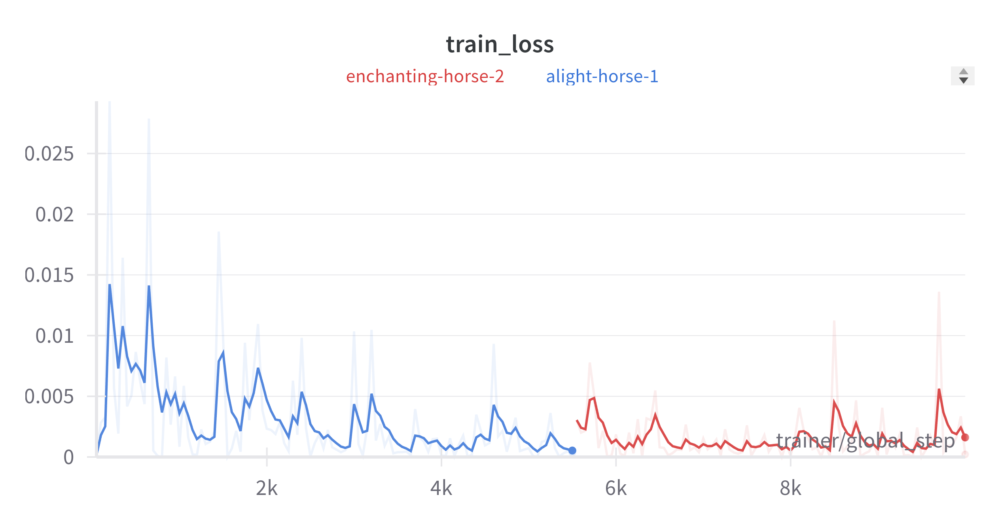
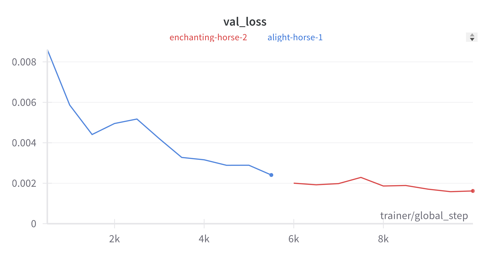

# Airbus Ship Detection

## Description

Train and run inference for ship segmentation task.


## Installation

Run commands:
```
$ git clone https://github.com/viktorpovazhuk/ship_segmentation_test_task.git
$ cd ship_segmentation_test_task
$ conda config --add channels defaults # to add defaults channel where some necessary packages are persisted
$ conda config --append channels pytorch # to append pytorch channel where pytorch package is persisted
$ conda create --name v_ship_segmentation --file requirements.txt
$ conda activate v_ship_segmentation
$ pip install .
```

## Training

Run next command.

```
$ ship-train \
        --batch_size 8 \
        --learning_rate 1e-3 \
        --epochs 20 \
        --images_path <YOUR_PATH_TO_IMAGES> \
        --metadata_path <YOUR_PATH_TO_CSV_FILE> \
        --output_path "output"
```

By default, output is saved in ./output.

Other options can be obtained with:

```
$ ship-train --help
```

## Inference

If you want to try my trained baseline:
1. Download it from google (val_dice=0.55.ckpt): [Link](https://drive.google.com/drive/folders/1CcM5umt79DzRcDOe7YY5pR_N31gcHhCU?usp=drive_link).
2. Save into folder ./samples/baseline/ckpts.

Run next command.

```
$ ship-predict \
        --image_path "samples/images/4de149bd9.jpg" \
        --ckpt_path "samples/baseline/ckpts/val_dice=0.55.ckpt"
```

By default, output is saved in ./output/predictions.

Other options can be obtained with:

```
$ ship-predict --help
```

## Methodology

One of the most common approaches for segmentation task is a U-Net model, consisting of encoder and decoder parts. As described in [paper](https://arxiv.org/pdf/1801.05746.pdf) VGG11 pretrained on ImageNet was used as an encoder.

Neural network is implemented in pytorch and pytorch lightning with cross entropy as a loss function. The metric is dice score. And for visualizations I leveraged matplotlib.

## Structure of project

./eda_images: images used in EDA jupyter notebook. \
./examples: some examples created during project development. \
./samples: baseline trained model and data samples for inference. \
./src: src code of project.

## Baseline

Train parameters.

| Parameter  | Value |
| ------------- | ------------- |
| Device  | GPU T4  |
| Learning rate  | 1e-3  |
| Epochs  | 20  |
| Continue training  | False  |

Train and validation cross entropy losses.




Prediction example.


## TODO

- [ ] Change loss function to Focal Loss -> retrain a model
- [x] Change structure of project and add .toml file for installation
- [ ] Use rle function from Kaggle
- [ ] Implement prediction threshold